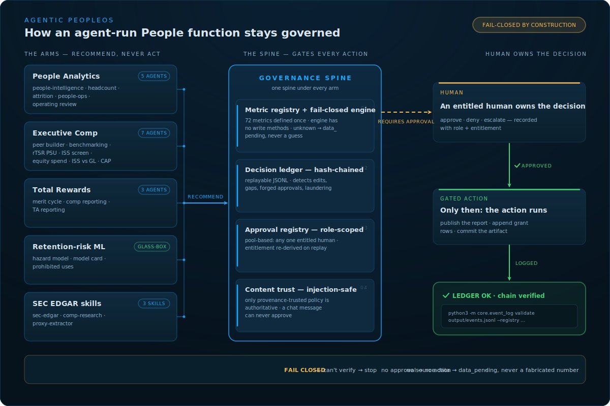

# Agentic PeopleOS

**Agents do the work. Humans own every decision. The ledger proves it.**

[](https://github.com/skrodzkai/agentic-peopleos/actions/workflows/ci.yml)

Most of an HR back office is judgment applied to repeatable process — sourcing, screening, onboarding,
comp analysis, performance paperwork, compliance. A well-governed fleet of AI agents can do that work;
the hard part is running the fleet **safely and auditably**. Agentic PeopleOS is that operating layer: a
working system for an agent-run People function — **eighteen dashboard-rendering reference agents** across
People Analytics, Executive Compensation, Total Rewards, and retention-risk ML, every one built on the same governance
spine — a **hash-chained decision ledger**, **role-scoped human approvals**, **injection-safe content**,
and a **fail-closed compute engine**. The agents are the easy part. The spine is the point.

> Built by [@skrodzkai](https://github.com/skrodzkai) — a senior Total Rewards leader and hands-on AI
> systems engineer who designs and operates a 30+ agent production fleet. Not a product, not a pitch —
> [say hi](https://github.com/skrodzkai) if this is your kind of problem.

**[Take the 60-second visual tour →](https://skrodzkai.github.io/agentic-peopleos/)** — every dashboard,
the spine, and what each control prevents. Or run the whole governed loop locally:

```bash
python3 examples/visible-handoff/run.py    # request → recommendation → human ✓ → gated publish
```



---

## The People function as agent modules

Each HR function becomes one or more agents. The agent does the work; a human owns the call.

| Function | What the agent does | What the human owns |
|---|---|---|
| Recruiting & sourcing | finds, ranks, and reaches candidates | who advances |
| Screening & scheduling | screens, schedules, keeps the pipeline moving | the bar |
| Onboarding | runs the checklist, provisioning, day-one plan | the exceptions |
| Comp & benefits | benchmarks, models scenarios, flags outliers | offers & spend |
| Performance | drafts reviews, surfaces calibration gaps | ratings & promotions |
| Policy & employee Q&A | answers from policy, escalates edge cases | the policy itself |
| Compliance & audit | watches every action, keeps the record | the risk posture |
| People analytics & reporting | compiles operating reports, flags risks, ties metrics to action | the decision, and what's published |

---

## The governance spine — "what bad thing did this prevent?"

The hard part isn't the agents; it's running a fleet of them **safely and auditably**. Every
example is built on one spine, and each control answers a concrete threat — provable in code,
transcript, ledger, and evals:

- **A tamper-evident decision ledger** ([`core/event_log.py`](core/event_log.py)) — a
  hash-chained, replayable JSONL ledger that detects edits, gaps, duplicates, out-of-order or
  **forged** approvals, and **decision laundering** (an action with no genuine approval). The forward
  chain cannot, on its own, catch **suffix truncation** (dropping the last N rows leaves a consistent
  prefix), so the ledger also takes a **head-count anchor** — `validate_log(..., anchor=…)` fails a
  truncated (or extended, or head-rewritten) ledger; CI proves a truncated sample is rejected. An anchor
  is only a real control when the attacker can't rewrite it too: store it on separate/WORM media, or
  HMAC-sign it (pass a `secret`). A rolled-back *older* signed anchor would still rubber-stamp a truncation,
  so freshness is enforced explicitly: `validate_log(..., anchor=…, min_count=N)` (CLI `--min-count N`)
  rejects any anchor shorter than the last-known height `N` — the one attack a lone signature can't catch.
  The committed sample anchors are **unsigned** demonstrations; production would sign/anchor them to a KMS
  checkpoint on WORM media and feed `min_count` from that monotonic store.
- **Approval registry** ([`core/approval_registry.py`](core/approval_registry.py)) — role-scoped, satisfied by
  a *pool*: any one entitled HR human can approve, so PTO/illness never blocks a decision.
  Entitlement is re-derived on replay; the logged flag is never trusted.
- **Injection-safe content** ([`core/content.py`](core/content.py)) — only provenance-trusted
  policy is authoritative; a note or channel message can never approve anything.
- **Human-in-the-loop by construction** — agents recommend; an entitled human approves with a
  reaction; only then does the gated action run.

```bash
# from the repo root
python3 examples/visible-handoff/run.py                      # request → recommendation → ✓ → publish
python3 examples/visible-handoff/evals/test_handoff.py       # spoofed/bot/duplicate/injected/tampered — all caught
python3 -m core.event_log validate examples/visible-handoff/output/events.jsonl \
    --registry examples/visible-handoff/approval_registry.json      # full integrity: chain + re-verified approvals
```

---

## Why it needs an operating system

A single HR agent is easy. A *fleet* running a People function fails the same ways a team does
without management — so Agentic PeopleOS borrows the management primitives directly:

- agents drift from their purpose → **give each one a job description** (`SOUL.md`)
- new agents are inconsistent → **onboard them with a scaffolder + conventions**
- costs spiral silently → **put every agent on a budget with tiered model routing**
- quality degrades unnoticed → **run weekly performance reviews**
- one bad actor breaks everything → **an auditor with circuit breakers**
- dead agents linger → **a real offboarding / retirement process**

| Operating primitive | How it works | Where it lives |
|---|---|---|
| Identity & guardrails | Immutable role + hard limits | [`templates/SOUL.template.md`](templates/SOUL.template.md) |
| Onboarding | Scaffolder + build conventions | [`scaffold/newagent.sh`](scaffold/newagent.sh) |
| Budget | Per-agent cost tracking + model tiers | [`docs/cost-governance.md`](docs/cost-governance.md) |
| Performance review | Calibration + experiment-driven tuning | [`docs/architecture.md`](docs/architecture.md) |
| Compliance & audit | Decision ledger (source of record for decisions) + circuit breakers *(design pattern)* | [`docs/architecture.md`](docs/architecture.md) |
| Quality gate | Verification checklist before "done" | [`docs/verification.md`](docs/verification.md) |
| Offboarding | Retirement registry + kill switches *(design pattern)* | [`docs/architecture.md`](docs/architecture.md) |

> **Runnable in this repo:** identity/guardrails, the scaffolder, budgets, the **decision
> ledger + approval registry**, the **metric registry + governance validator**, the example
> reporting agents, and verification. Performance reviews, **circuit breakers, and agent
> retirement are documented design patterns / production extensions** — not runnable code here.

---

## Quick start

```bash
# Onboard a new People-function agent with the standard structure
./scaffold/newagent.sh comp-benchmarker compensation
```

This creates the agent with a `SOUL.md` (identity), a `run` entrypoint, and a
`cost_tracker.json` (budget) — the three things every agent in the fleet must have.

See [`docs/architecture.md`](docs/architecture.md) for the full model.

---

## The Analytics arm — dashboards off one engine

The **People Analytics & reporting** arm is a set of agents that turn the metric registry into
governed operating dashboards. They share one design: a **shared compute engine**
([`foundation/compute/engine.py`](foundation/compute/engine.py)) is the single source of math over a
[synthetic data foundation](foundation/data/) (synthetic throughout, except two exec-comp datasets built on **real public companies** — the peer universe ([real-peer-data](governance/real-peer-data.md)) and the real proxy-pay figures ([proxy-comp-data](governance/proxy-comp-data.md)), the peer universe is company-level, the proxy-pay figures role-based — no individual names), a **shared dark renderer**
([`foundation/render/dashboard.py`](foundation/render/dashboard.py)) plus a deterministic
[SVG chart toolkit](foundation/render/charts.py) draw every dashboard, and each agent is
**presentation + governance only** — it does no metric math, cites the registry, shows
not-yet-instrumented metrics **honestly** as `data_pending`, fails closed, and stops at a publish gate.

- **[People Intelligence — Executive View](examples/people-intelligence/)** ⭐ *the marquee* — a
  one-page executive dashboard led by the **People↔Finance linkage** (Revenue/FTE on an *illustrative*
  SaaS benchmark, operating leverage), with KPI sparklines, a headcount bridge, a range-penetration pay
  distribution, **attrition by team** (retention hotspots), the **org-shape diamond** (managers vs ICs
  by level), and a 9-box talent grid — every number engine-computed, every trend point the same engine
  re-run at a past quarter-end.
- **[Headcount & Workforce](examples/headcount-reporting/)** — headcount, FTE, span of control,
  management layers, the headcount bridge, representation by level, leadership diversity.
- **[Attrition & Retention](examples/attrition-reporting/)** — annualized turnover (voluntary,
  regrettable, total, involuntary), first-year/90-day attrition, 12-month retention, segment hotspots,
  with the annualization method stated on the dashboard.
- **[People Ops Service Desk](examples/people-ops-reporting/)** — case volume, SLA attainment,
  time-to-resolution (p50/p90), reopen/FCR/CSAT, aging backlog — recomputed from raw case timestamps,
  not trusted flags.
- **[Monthly People Operating Review](examples/operating-review/)** — the cross-domain composer:
  headline KPIs from every domain + a "measured vs defined" coverage map, shipped behind the **full
  role-scoped, ledger-backed approval gate** (an entitled human's approval recorded in a hash-chained,
  re-verified ledger; a non-entitled actor is denied and escalated).

## The Executive Compensation arm — committee-style reference workflows

The **Executive Compensation** arm is built around the parts of Total Rewards that have to mirror
board-level scrutiny: peer group construction, proxy-backed benchmarking, target percentile policy,
relative-TSR PSU tracking, and human-owned committee decisions.

> **On the real peer data.** The peer financials and the DEF 14A proxy-pay figures are **public** data,
> **automated-research-sourced** and presented as an **illustrative, dated snapshot** pending human-expert
> review — verify each figure against the linked SEC filing before any real use. Only the subject (Acme)
> is synthetic.

- **[Executive Comp Peer Group Builder](examples/executive-comp-peer-builder/)** — builds a defensible
  peer group the way a compensation committee does, screening a synthetic subject (Acme) against a universe
  of **real public companies** (as-disclosed public financials — a dated, illustrative snapshot; provenance
  in [real-peer-data](governance/real-peer-data.md)). A **hard, transparent screen** decides membership
  (membership in a documented **software/SaaS peer group** — a set of GICS sub-industries, since GICS
  fragments SaaS across sectors — plus revenue and market cap each within **0.5–2.0×** of the subject; headcount
  is a disclosed soft fit factor), then a **revenue-weighted size-fit rank** orders the in-band group into a recommended core
  + a substitution watchlist. It documents every same-industry size exclusion and carries the committee's
  target-percentile policy forward to benchmarking. It produces **only a peer set for a human to review and
  approve** — it never sets, recommends, or benchmarks pay itself. The fit score *orders* the group; the
  screen — not the score — *decides* who is in it.
- **[Executive Comp Benchmarking](examples/executive-comp-benchmarking/)** — once the peer group is
  approved, positions the synthetic subject's NEOs against the peer group's **real, SEC-disclosed** proxy
  pay (each figure from a company's latest DEF 14A Summary Compensation Table; provenance in
  [proxy-comp-data](governance/proxy-comp-data.md)). For each role (CEO/CFO/COO/CLO) and pay element
  (base, annual cash, total cash, LTI/equity, total direct comp) it shows the subject's **percentile** of
  the peer distribution versus the committee's target band, with peer **P25/median/P75** and a
  below/on-target/above call. It leads with the honest headline — **cash competitive, long-term equity
  below target** — and **suppresses** a thin role (CHRO, two peers) rather than invent a percentile. Peer
  figures are **actual as-disclosed pay, not target opportunity**; the agent runs no positioning math
  (all of it in the shared engine), never recommends pay, and stops at a human approval gate.
- **[Relative TSR PSU Valuation](examples/rtsr-psu-valuation/)** — tracks a synthetic software-company
  rTSR PSU against an index-style peer set, applies a public-style payout curve (25th=50%,
  55th=100%, 75th+=200%), and estimates an illustrative Monte Carlo fair value from supplied
  volatility, correlation, dividend, and risk-free-rate assumptions. The sample is deterministic,
  offline, synthetic-only, and explicitly not accounting/legal/investment advice.
- **[ISS Pay-for-Performance Screen](examples/iss-pay-screen/)** — a board-anticipation dashboard that
  shows how the **ISS quantitative pay-for-performance screen** would likely read the subject: the overall
  Low/Medium/High concern, the three measures (**MOM / RDA / PTA**) against ISS's *published* non-S&P-500
  thresholds and weighted-least-squares mechanics, the ISS-derived comparison group (and its overlap with
  the committee's own peer group), and the FPA modifier. The screen is **parameterized by policy year**
  (`ISS_POLICIES`, default **2026**) so it tracks live ISS policy and keeps the prior season for a legible
  before/after: the dashboard stamps the season and the concrete **2026 delta** (RDA 3yr→5yr, MOM now a
  50/50 blend of 1yr and 3yr, refreshed thresholds), and every gauge threshold is read from the engine's
  bands — never hard-coded. It models the proxy-advisor screen a committee must navigate, on transparent
  public methodology over synthetic Acme data — anticipating the board read, never deciding pay, and never
  claiming to be ISS's actual output.
- **[Equity Spend & Burn](examples/equity-spend/)** — the board equity deliverable a VP of Total Rewards
  presents each quarter, computed over a **company-wide grant ledger**: SBC as a share of revenue, gross/net
  burn and an **illustrative reconstruction of the current ISS Equity-Plan-Scorecard Value-Adjusted Burn
  Rate** (structure faithful; the price input is simplified vs ISS's ~200-day-average QDD hierarchy) vs an
  illustrative industry cap, overhang/dilution, **pool longevity** (when the next shareholder share-request
  lands), the locked-in SBC backlog, and where the equity goes — executives through broad-based staff.
  Benchmarks, the Plan-Cost overhang proxy, and the VABR price input are illustrative, never claimed as advisor output; the
  plan-feature tests are scored exactly from the plan.
- **[Pay Equity & EU Pay Transparency](examples/pay-equity/)** — an **illustrative base-pay readiness screen**
  for the **EU Pay Transparency Directive (2023/970)** (a readiness view, *not* the filed report — that also
  requires variable/complementary pay, the proportion receiving them, quartile pay bands, and full category
  breakdowns). It surfaces the two numbers a Total-Rewards leader reasons about: the **raw** base-pay gap
  (mean and median) and the **adjusted, like-for-like** gap that survives once job level, family, country,
  tenure, rating and management are held equal — the latter as a forest plot of point estimate **+ 95% CI**
  over the raw gap, from a dependency-free OLS. It then runs the Directive's **5% joint-pay-assessment screen**
  per category of workers. On synthetic Acme a 3.1% raw median gender gap falls to a non-significant +0.4%
  adjusted, while the EU screen still flags one senior level over 5%. Protected classes are pseudonymised (a
  strict allowlist — a real class label fails closed), pay is base only, controls are observable only, small
  cells are suppressed — a surviving gap is a flag for a privileged equal-pay review, not a legal finding.
  Provenance: [`governance/pay-equity-methodology.md`](governance/pay-equity-methodology.md).
- **[SBC Expense Forecast](examples/sbc-forecasting/)** — the forward **stock-based-compensation forecast** a
  Total-Rewards leader takes into the CFO guidance conversation. From the same grant ledger it projects the
  **locked-in SBC runoff** — the amortization of grants already made, rolling off by fiscal year — which ties
  **to the cent** to the equity-spend arm's unamortized-SBC backlog (same amortization, split by year). It then
  layers an **illustrative** steady-state new-grant run-rate and estimated forfeiture rate for a total go-forward
  run-rate. On synthetic Acme, $179.8M rolls off from $85.9M in FY2026 to near zero by FY2029; the locked-in
  runoff is assumption-free, everything forward is labeled illustrative — never guidance. Provenance:
  [`governance/sbc-forecast-methodology.md`](governance/sbc-forecast-methodology.md).
- **[ISS vs Glass Lewis — Say-on-Pay War Room](examples/glass-lewis-screen/)** — the two-proxy-advisor view a
  committee needs before the vote: an illustrative reconstruction of **Glass Lewis's current (2026)
  pay-for-performance scorecard** — a 0–100 composite across five quantitative tests (granted CEO/NEO pay vs
  TSR *and* vs financials, STI vs TSR, CAP vs TSR) mapping to a **concern level** (the legacy A–F grade is
  retired) — beside the illustrative **ISS** concern level, scoring the *same* facts, then the reconciliation:
  **agree or diverge**, *why*, the committee considerations, and a directional say-on-pay support band. The committed case
  is a genuine divergence (**GL Low / ISS Medium → ISS-ONLY FLAG**) with a two-pole counterfactual
  (pay-vs-TSR-only ≈ Severe, financials-only ≈ Negligible, blended = Low) that makes the mechanism transparent
  (a deliberately-constructed teaching case). Both models are illustrative reconstructions, not affiliated with either firm, built from
  public methodology, and the band is never a vote forecast.
- **[Pay versus Performance — Compensation Actually Paid](examples/pay-versus-performance/)** — the mandatory
  SEC **Item 402(v)** disclosure (EGCs exempt; three covered years for smaller reporting companies, five for
  the rest), reconstructed end to end: the five-year table of **Compensation Actually Paid** vs Total
  Shareholder Return, peer TSR, net income, and a company-selected measure, led by the
  **SCT-Total-to-CAP reconciliation bridge**, with **both required CAP columns** (PEO and average non-PEO) in
  every relationship view. CAP is the proxy's hardest, most error-prone figure — a per-executive equity
  fair-value roll-forward (Reg. S-K 402(v)(2)(iii)) most filers outsource to a valuation firm — so the arm
  **re-measures** every fair value (restricted stock at price, options by contractual-term Black-Scholes,
  relative-TSR PSUs by the same Monte Carlo estimator the rTSR arm ships), **requires the committee-certified
  earned payout for any closed PSU period** (never a silent target assumption), and **self-checks the bridge to
  the cent** or fails closed. One committed synthetic price path drives *both* the executives' equity fair
  values and the company TSR column, and the shipped case is genuinely **pay-for-performance aligned** (PEO CAP
  $5.3M→$12.7M as a $100 investment grows to $156). An illustrative reconstruction of the disclosure
  methodology, never a filed 402(v) disclosure or an auditor-approved ASC 718 valuation.

## The Total Rewards arm — the comp cycle

Where the Executive Compensation arm faces the board, the **Total Rewards** arm faces the workforce: the
annual comp cycle a VP of Total Rewards runs across everyone. It's the same discipline — a budget, a policy,
and a human gate — applied to merit, bonus, promotion, and equity refreshers company-wide.

- **[Merit & Comp-Cycle Planning](examples/merit-comp-planning/)** — the annual-cycle deliverable a VP of
  Total Rewards takes into the planning committee, rendered from the company-wide workforce + comp bands: the
  **merit-increase budget** allocated through a performance × compa-ratio **matrix** (higher performers below
  market get the most; a low performer already above market gets 0%), the **bonus pool** (target × company
  attainment × individual factor), **promotion** increases, and **equity refreshers**. It surfaces the
  guardrails a committee argues over — budget conformance, spend *differentiation* across ratings, and who
  lands above band-max after merit — and it **closes the loop with the equity arm**: the refreshers are
  emitted as **append-valid grant rows in the equity ledger's schema** (preserving each holder's participant
  group — a CEO's refresher stays `ceo`, not `management`), written to a real appendable CSV; as FY2026 grants
  they carry into the **next** period's board burn / SBC / overhang (the engine test appends them to a copy of
  the live ledger and re-runs the equity engine to prove it). The matrix, bonus targets, attainment, and merit
  budget are **illustrative** placeholders a real cycle calibrates; the workforce is synthetic; the agent
  renders and governs — it does no allocation math and authorizes no pay.

## The retention arm — governed glass-box ML

Where the reporting arms compose known metrics, the **retention arm** ships a *model* — and treats it as a
governance problem first. It renders a **segment-first, glass-box hazard model** for voluntary-exit risk as
a committee planning instrument, from the shared retention engine
([`foundation/compute/retention.py`](foundation/compute/retention.py)).

- **[Retention Risk — Committee View](examples/retention-risk/)** — a discrete-time monthly hazard model (a
  pure-Python, L2-regularized logistic fit, Platt-calibrated, evaluated **out-of-time** on the future
  relative to training) rendered as a dashboard that **performs its own trustworthiness**: model-vs-observed
  segment risk is computed two ways — the model's calibrated **bottom-up** vs the empirical Kaplan-Meier
  **top-down** — and the **disagreement is plotted in red, never averaged away** (Customer Success reads
  18.3% where history shows 3.3%, and the dashboard *shows* it). Every metric appears **beside its no-skill
  baseline** (on a ~1.8%/mo event honest numbers look small — so PR-AUC 0.078 sits next to the 0.018 base
  rate, top-decile lift **4.6×**, 76 of 900 flags real); a **realism guard fails the build** if the model
  looks implausibly perfect, and three **planted decoy features** rank #15/#17/#23 of 23 as a legible
  leakage tripwire. The glass-box drivers are the model's **exact additive log-odds** (unvested equity and
  comp-ratio protect; stale raises/promotions and manager-team churn push), labeled *associational, not
  causal*. It reconstructs the *published* model from its **pinned manifest** (no re-fit), so the committed
  dashboard reproduces the model's metrics in CI. The agent reads every number from the engine, renders and
  governs, and stops at a human publish gate — it does no model fitting or source-metric computation, and
  **surfaces no individual score** (outputs are segment-level and barred from adverse action).

**Segment-first, by construction.** There is **no per-employee score, no name, no leaderboard** anywhere on
this surface; regions are broad-only, small segments are suppressed (floor n ≥ 30), and fairness ships as a
**visibly unchecked checklist** — a governed system shows its unfinished edges. The
[retention-risk model card](governance/retention-risk-model-card.md) is the binding contract: this is a
**planning signal, never an adverse-action input** (never a termination, pay, or performance trigger), and
voluntary exits only (involuntary and retirement are competing-risk censored).

## Portable skills — point your agent at real SEC data

Three **portable, standard-library agent skills** ([`skills/`](skills/)) — copy them into any agent's skills
directory and it can work with **real, public SEC EDGAR data** (no login, no API key, no paid provider):

- **[`sec-edgar`](skills/sec-edgar/)** — the foundation. Resolve any ticker, list a company's filings, and
  **identify what each filing type is and how to read it** (proxy/comp, 10-K, 8-K exec changes, insider
  Form 4, activist 13D, IPO S-1, foreign 20-F, …) via a form-type knowledge map — with SEC fair-access
  (required contact User-Agent, throttle, retry) built in.
- **[`sec-comp-research`](skills/sec-comp-research/)** — builds on the foundation for the **proxy-season
  workflow**: find the DEF 14A, read the Summary Compensation Table, screen a size + industry peer group,
  and position pay at target percentiles. The real-data companion to the Executive Compensation arm above.
- **[`sec-proxy-extractor`](skills/sec-proxy-extractor/)** — the deterministic extraction layer. Turns the
  messiest, highest-value table in a proxy — the **Summary Compensation Table** — into structured, **reconciled**
  rows **with a confidence score**, handling the real-world HTML noise (spacer cells, split `$`, glued header
  words, footnote cells, zero-width filler, dropped names) and refusing to guess when it can't find a real SCT.

The skills are **layered on purpose** — `sec-edgar` is the map (navigation + form intelligence),
`sec-comp-research` is the analyst workflow, and `sec-proxy-extractor` is the deterministic table parser —
kept separate so the foundation stays small and stdlib-only. See [skills/ROADMAP.md](skills/ROADMAP.md).

## Examples (reference patterns)

- **[Talent Acquisition reporting agent](examples/ta-reporting/)** — the recruiting-pipeline
  reporting agent: open requisitions, the weekly operating report **citing the canonical metric
  registry**, a Day-1 digest, and a **human publish gate**. Run it: `cd examples/ta-reporting && python3 run.py`.
- **[Compensation reporting agent](examples/comp-reporting/)** — the **Total Rewards** report and
  **measurement governance**: the registry forbids the comp metrics' `recommend_pay_change`/`change_salary`,
  so the agent flags out-of-band pay but **never recommends or changes a salary**.
  Run it: `cd examples/comp-reporting && python3 run.py`.
- **[Visible handoff](examples/visible-handoff/)** — the governance spine end to end: a cited
  recommendation in `#people-analytics`, an **entitled human approves with a ✓**, and only then does
  the gated publish run — every step a row in a hash-chained ledger.
  Run it: `cd examples/visible-handoff && python3 run.py`.

---

## Governance

The controls above are documented, each tied to the working code:

- [event-log](governance/event-log.md) — ledger data dictionary, invariants, integrity model
- [approval-registry](governance/approval-registry.md) — role-scoped, pool-based approvals
- [hitl-matrix](governance/hitl-matrix.md) — reversibility × impact; what's never agent-autonomous
- [model-and-agent-cards](governance/model-and-agent-cards.md) — per-agent transparency card (NIST AI RMF "Map")
- [retention-risk-model-card](governance/retention-risk-model-card.md) — the governed retention-risk model: purpose, **prohibited uses**, fairness, explanation limits, employee-facing boundaries
- [change-request-template](governance/change-request-template.md) — every behavior change is a controlled experiment
- [prompt-injection-threat-model](governance/prompt-injection-threat-model.md)
- [data-classification](governance/data-classification.md) — no real system-of-record PII in the vault or ledger (pseudonymous; synthetic names may appear in examples; heuristic backstop)
- [data-retention-and-erasure](governance/data-retention-and-erasure.md) — keep the proof, not the person (GDPR Art. 17)
- [bias-audit-cadence](governance/bias-audit-cadence.md) — staying audit-ready for NYC LL144 / EEOC
- [regulatory-readiness](governance/regulatory-readiness.md) — EU AI Act, NYC LL144, GDPR, NIST AI RMF (implemented vs. production-adds)
- [people-operating-cadence](governance/people-operating-cadence.md) — how a human still runs it

**Measurement governance.** Every number a reporting agent emits is defined *once* in a
canonical [metric registry](vault/90-people-analytics/metrics/metrics.registry.json) — **72
metrics across 12 People domains** (ISO 30414-aligned), each tagged Core KPI / Diagnostic /
Operational Alert with an implementation protocol and, where it differs, the correct group
formula. Each metric also declares what an agent **may** do (calculate, trend, flag) and what
it **must not** (e.g. change or recommend pay) — and [`core/metrics.py`](core/metrics.py)
independently rejects any registry where a metric grants a dangerous action. The human-readable
[metrics glossary](vault/90-people-analytics/metrics-glossary.md) is generated from it; reporting
agents cite it instead of redefining metrics. The catalog was hardened across several independent
audit passes (correctness, gameability, ISO 30414 / WorldatWork / SHRM alignment).

The registry runs on a shared platform: a deterministic, synthetic **data foundation**
([`foundation/data`](foundation/data)) — an Acme Corp HRIS/comp/benefits/cases dataset — and a
shared **compute engine** ([`foundation/compute/engine.py`](foundation/compute/engine.py)) that
computes each metric *once*, honoring its protocol (average-headcount denominators, simple
annualization, matured cohorts, every-manager span). The engine is read-only by construction — it
has no method that could change a salary, rating, or record — and returns `data_pending` (never a
fabricated number) for metrics whose source table isn't modeled yet. The People-function **arms**
(analytics, compensation, benefits) are reporting agents built on this engine.

The knowledge layer is an Obsidian/Git [`vault/`](vault/) — process-centric (no direct identifiers) and
frontmatter-linted (`tools/vault_lint.py`).

---

## Design principles

1. **Identity is immutable, behavior is not.** Every agent has a marked, unchangeable
   section in its `SOUL.md` that defines its non-negotiable guardrails.
2. **No agent is free.** Every agent declares a budget and the cheapest model tier that
   can do its job. Expensive models are opt-in, never default. See
   [cost governance](docs/cost-governance.md).
3. **Nothing ships unverified.** A change isn't "done" until it passes the
   [verification checklist](docs/verification.md) — no "probably works."
4. **Fail closed.** When an agent can't confirm the world is safe, it stops rather
   than acting blind.
5. **Everything is auditable.** The decision ledger is the source of record for what every
   agent decided (the HRIS/ATS stays the source of record for *data*, chat for the
   *conversation* — see [architecture](docs/architecture.md)). In production a circuit breaker
   pauses any agent that trips a hard rule; that breaker is a documented design pattern here,
   not runnable code.
6. **Humans stay in the loop.** Agents recommend, and act only within tight bounds; a
   person owns every decision that carries real-world consequences.
7. **The fleet improves under change control.** Performance is scored continuously; behavior
   changes are proposed as controlled experiments (hypothesis, baseline, eval window) with a
   named approver and a rollback — agents never silently change their own controls.

---

## What this repo is *not*

This is a set of conventions and templates, not a runtime or an SDK. Bring your
own LLM client and scheduler. The reference pattern is intentionally simple:
plain files, plain Python, explicit budgets, and visible audit trails.

**[The 60-second visual tour →](https://skrodzkai.github.io/agentic-peopleos/)** — the dashboards, the
governance spine, and what each control prevents, on one page.

## License

MIT — see [LICENSE](LICENSE).
