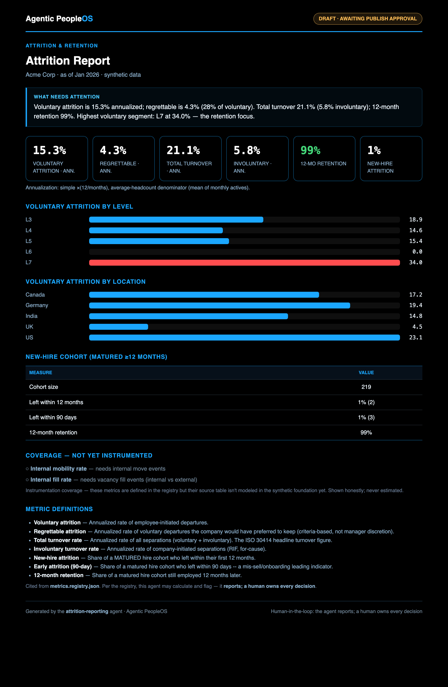

# Example: Attrition & Retention reporting agent

An Analytics-arm agent on the shared compute engine — an **attrition/retention operating dashboard**
for a fictional company (Acme Corp). It reports annualized turnover (voluntary, regrettable, total,
involuntary), first-year/90-day attrition, 12-month retention, and **voluntary-attrition segment
hotspots**, then **stops at a human publish gate**.

Same design as the rest of the arm: the **engine is the single source of math** (the agent does none),
the **annualization method is stated on the dashboard** (simple ×12/months, average-headcount
denominator), un-instrumented metrics are shown **honestly** as `data_pending`, and it's read-only,
fails closed, cites the registry, and **reports but never decides** (it never recommends termination).

> All data is synthetic. No real company, system, or person is represented.

## Sample output



## Run it
```bash
cd examples/attrition-reporting
python run.py
open output/report.sample.html
python run.py --publish --approved-by "People Analytics Lead"
```

## Test it
```bash
python evals/test_attrition.py
```
The eval proves the cards equal the engine's values, turnover splits reconcile (voluntary +
involuntary == total), the hotspot is the engine's max segment, `data_pending` is surfaced honestly,
fail-closed behavior, and the publish gate. See [`SPEC.md`](SPEC.md).
