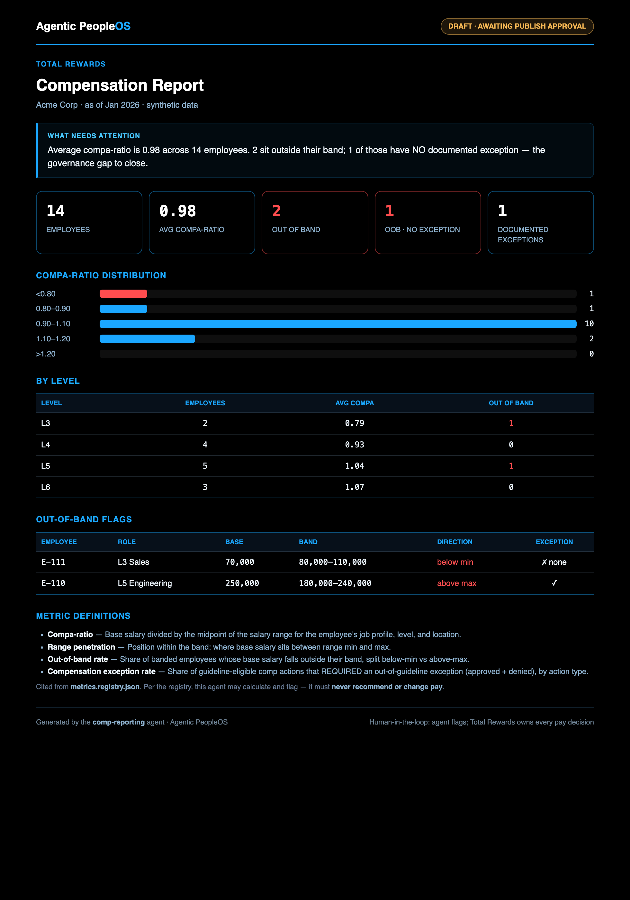

# Example: Compensation Reporting agent

A complete, runnable Agentic PeopleOS agent — a **Total Rewards compensation reporting
agent** for a fictional company (Acme Corp). It reads a comp snapshot, computes compa-ratio
/ range penetration / out-of-band rate / exception rate, flags pay that sits outside its
band, drafts a Day-1 digest, and **stops at a human publish gate**.

This is the second agent built on the **same canonical metric registry** as
[`ta-reporting`](../ta-reporting/) — two agents, one definition of every number. It exists
to demonstrate one idea the others only gesture at: **measurement governance.**

> **The agent measures pay. It never changes it.**
> The metric registry marks every comp metric's `recommend_pay_change` and `change_salary`
> as *forbidden actions*. The agent calculates and flags the governance gap; a human (Total
> Rewards) owns every pay decision. The eval proves the agent's output never recommends or
> sets a salary.

It demonstrates, in one small agent, the principles the framework is built on:

- **a defined identity** ([`SOUL.md`](SOUL.md)) with immutable guardrails
- **a budget** ([`cost_tracker.json`](cost_tracker.json)) and tiered model use (the report
  needs no model at all)
- **scoped tools** ([`tools.yaml`](tools.yaml)) — read-only, with no "send" and no "write-pay" tool
- **cited metrics** — every number is defined once in
  [`metrics.registry.json`](../../vault/90-people-analytics/metrics/metrics.registry.json)
  and the agent cites it instead of redefining it
- **human-in-the-loop** — it produces a *draft* and a human owns the publish decision
- **auditability** — the same input always produces the same report
- **an eval** ([`evals/test_comp.py`](evals/test_comp.py)) that guards the math *and* the
  governance boundary

> All data is synthetic. No real company, system, or person is represented.

## Sample output



A branded, self-contained HTML dashboard ([`output/report.sample.html`](output/report.sample.html))
plus a Day-1 digest. It opens with a data-derived insight ("what needs attention"), then KPIs,
the compa-ratio distribution, a by-level breakdown, an out-of-band flag table, the cited metric
definitions, and a governance footer.

## Run it

No dependencies — Python 3.9+ standard library only.

```bash
cd examples/comp-reporting
python run.py
```

This writes the report and digest to `output/` and stops at the publish gate. Then:

```bash
open output/report.sample.html          # the compensation report (macOS; use your browser)
cat  output/day1-digest.sample.md       # the digest a human reviews
```

To see the gate enforce itself:

```bash
python run.py --publish                                        # refused — needs a named approver
python run.py --publish --approved-by "Total Rewards Partner"  # records the human approval
```

## Test it

```bash
python evals/test_comp.py
```

The eval covers the metric math (compa-ratio = base / midpoint), the governance invariant
(the registry forbids pay changes and the agent's output never recommends or sets a salary),
the fail-closed data contract (missing / empty / malformed / unordered-band / duplicate-id
input), and the publish gate's exit codes.

See [`SPEC.md`](SPEC.md) for the full behavior, the measurement-governance table, the data
contract, the cited definitions, fail-closed handling, and the publish gate.
