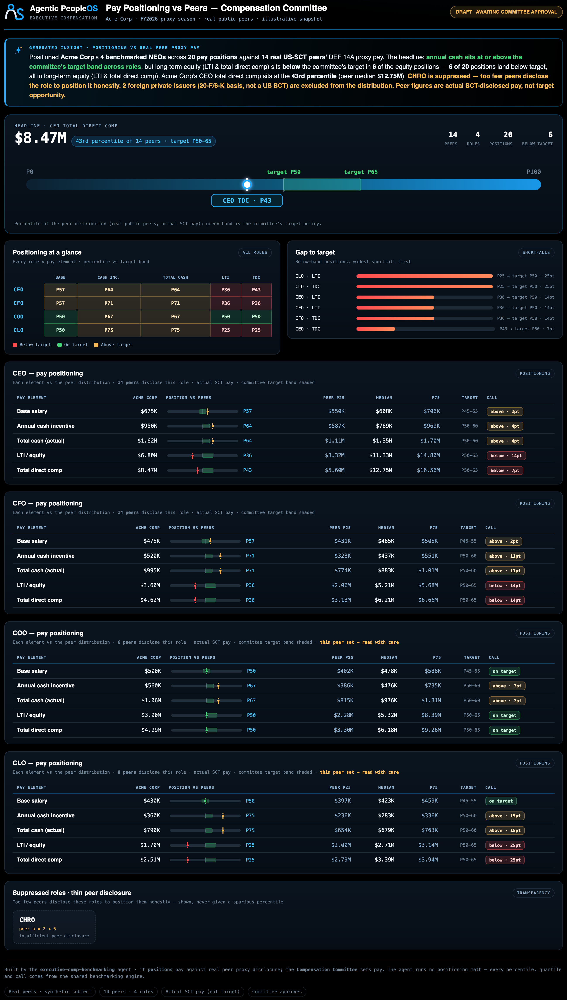

# Example: Executive Compensation Benchmarking

The second **Executive Compensation arm** agent: a dark, board-ready dashboard that positions the
subject's Named Executive Officers' pay against the approved peer group's **real, SEC-disclosed** proxy
pay — element by element, as a percentile of the peer distribution versus the committee's
target-percentile policy — and stops at a human approval gate. It never recommends pay.

It reads the shared benchmarking engine over the committed **real peer proxy dataset** (each figure from
a company's latest DEF 14A Summary Compensation Table; the subject is the same synthetic **Acme Corp**
the rest of the portfolio uses), and leads with the honest headline — including where the subject is
*behind* target.

> **Synthetic subject, real peer pay.** Acme (the subject) is synthetic; the peer figures are **actual,
> as-disclosed SCT proxy pay** for real public companies — an **illustrative, dated snapshot**
> (provenance + per-company SEC sources: [`governance/proxy-comp-data.md`](../../governance/proxy-comp-data.md)),
> **not** investment/comp advice; verify against each filing for current actuals. Peer figures are
> **actual pay, not target opportunity** — individual executive names are not stored (the dataset is
> role-based).

## What it shows (the way a committee reads a proxy)

For each benchmarked role (CEO / CFO / COO / CLO) and each pay **element** — base salary, annual cash
incentive, total cash, LTI / equity, total direct comp — the dashboard shows:

- where the subject sits as a **percentile** of the peer distribution (mid-rank), on a 0–100 track with
  the committee's **target band shaded**;
- the peer **P25 / median / P75** for that element;
- a **below / on-target / above** call, with the gap in percentile points.

The honest headline for Acme: **cash is competitive, but long-term equity sits below target across
roles** — 8 of 20 positions land below the committee's band, concentrated in LTI and total direct comp.
A thin role (**CHRO**, only two peers disclose it) is **suppressed**, not given a spurious percentile.

## The methodology (defensible by construction)

- **Actual, not target.** Peer figures are as-disclosed SCT pay (equity at grant-date fair value).
  Positioning actual pay against a target-percentile policy is the standard proxy read; the dashboard
  says so and never implies the peer numbers are targets.
- **One incumbent per company per role, medians not means.** A transition-year outgoing officer is
  dropped; a single founder mega-grant can't distort the market read.
- **Suppress thin roles.** A role below the engine's minimum peer count is shown suppressed, never
  positioned off two data points.
- **US SCT only in the distribution.** Two peers are foreign private issuers (they file a 20-F / furnish a
  6-K circular, not a US Summary Compensation Table, and their grant-date equity is not cleanly comparable);
  they are **excluded** from the percentile distribution and surfaced as a caveated count — the math runs on
  the 14 US-SCT peers.
- **Row-level provenance.** Every peer figure in `proxy_comp.csv` carries its SEC filing URL, form type,
  currency, extraction date, and a per-row basis caveat — so any number traces back to the exact filing.

## Run it
```bash
cd examples/executive-comp-benchmarking
python3 run.py                                              # draft only
python3 run.py --publish                                    # refused: needs a named committee approver
python3 run.py --publish --approved-by "Compensation Committee Chair"
```

## Test it
```bash
python3 evals/test_benchmarking_agent.py
```

## Sample output



- [Committee dashboard (HTML)](output/report.sample.html)
- [Committee digest](output/day1-digest.sample.md)

## What it demonstrates

- **Honest positioning:** leads with where the subject is *behind* target (equity), not only where it is
  competitive — the read a committee actually needs.
- **Actual-vs-target discipline:** peer pay is labelled as as-disclosed SCT actuals, positioned against
  a target-percentile policy — the seam a comp professional probes first, made explicit.
- **Presentation + governance only:** every percentile, quartile and call comes from the shared
  benchmarking engine; the agent does no math, suppresses thin roles, fails closed, and stops at a human
  approval gate.
- **Real peers, synthetic subject:** the peer distribution is real public-company proxy pay (dated
  snapshot, per-company SEC sources); only Acme is synthetic, and no individual name is stored.

## Related

- [`executive-comp-peer-builder`](../executive-comp-peer-builder/) — builds the peer group this agent
  benchmarks against (run it first; this agent positions pay once the group is approved).
- [`skills/sec-comp-research`](../../skills/sec-comp-research/) — a portable skill that pulls the same
  kind of real proxy data from SEC EDGAR for any tickers you supply.
