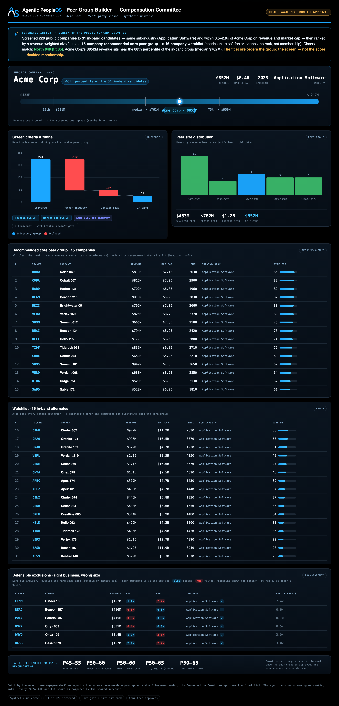

# Example: Executive Compensation Peer Group Builder

The first **Executive Compensation arm** agent: a dark, board-ready dashboard that builds a defensible
executive-comp **peer group** the way a Compensation Committee actually does it — a hard screen for
membership, then a transparent fit-rank for ordering — and stops at a human approval gate.

It reads the shared screener over a synthetic public-company universe (subject = the same **Acme Corp**
the rest of the portfolio uses), proposes a recommended **core peer group** plus a substitution
**watchlist**, documents every exclusion, and carries the committee's target-percentile policy forward
to the benchmarking arm. It never recommends pay.

> All companies and data are synthetic. No real issuer, ticker, peer group, board material, or proxy
> filing is represented.

## The two-step model (the way a committee works)

1. **Screen — the gate.** Membership is decided by a hard, transparent per-criterion pass/fail:
   revenue and market cap each within **0.5–2.0×** of the subject, and the same **GICS sub-industry**.
   Every inclusion and exclusion defends itself on one line. **Headcount is a *soft* factor** (not a
   gate) — matching disclosed market practice, where revenue and market cap are the primary size anchors.
2. **Fit-rank — the order.** Within that in-band group, peers are ranked by a pure **revenue-weighted
   size-closeness** score over revenue, market cap, and headcount (100 = identical size; 0 = at a band
   edge) into a recommended **core** and a **watchlist**. The score *orders* the group; it never changes
   who is in it.

This separation is the point: a board can challenge a *score* ("who set those weights?"), but not a
*transparent screen* ("same sub-industry, within 0.5–2.0× our size").

## Run it
```bash
cd examples/executive-comp-peer-builder
python3 run.py                                              # draft only
python3 run.py --publish                                    # refused: needs a named committee approver
python3 run.py --publish --approved-by "Compensation Committee Chair"
```

## Test it
```bash
python3 evals/test_peer_builder.py
```

## Sample output



- [Committee dashboard (HTML)](output/report.sample.html)
- [Committee digest](output/day1-digest.sample.md)

## What it demonstrates

- **Defensible by construction:** membership is a transparent in/out screen; the fit score only orders
  the group it never gates. Both survive a board's cross-examination.
- **Committee record:** same-industry companies kept out on size are listed with the exact criterion
  they failed — no cherry-picking.
- **One consistent company:** the subject is the same synthetic Acme used across the whole portfolio
  (no second, contradictory profile).
- **Presentation + governance only:** every PASS/FAIL and fit score comes from the shared screener; the
  agent does no math, fails closed, and stops at a human approval gate.
- **Bridges to benchmarking:** carries the committee's target-percentile policy forward — applied only
  after the peer group is approved. No pay recommendation is made here.
