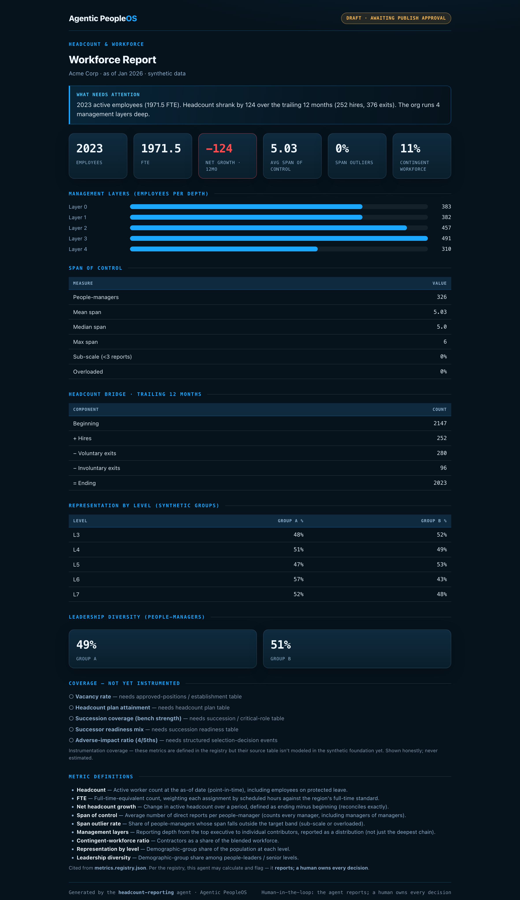

# Example: Headcount & Workforce reporting agent

The first agent of the **Analytics arm** built on the shared compute engine — a **workforce
operating dashboard** for a fictional company (Acme Corp). It reads headcount, FTE, span of control,
management layers, the headcount bridge, representation, and leadership diversity from the engine,
renders a dark operating dashboard, drafts a Day-1 digest, and **stops at a human publish gate**.

It demonstrates the design that the whole Analytics arm is built on:

- **The engine is the single source of math.** The agent calls
  [`MetricEngine.compute()`](../../foundation/compute/engine.py) and renders the result — it does
  **no metric math of its own** and never redefines a metric.
- **Honest coverage.** The registry defines 14 workforce metrics; **9 are computable** on the
  synthetic foundation today and **5 are shown as `data_pending`** with their named source needs —
  never a fabricated number.
- **Shared renderer.** One dark dashboard component ([`foundation/render/dashboard.py`](../../foundation/render/dashboard.py))
  so every arm report looks the same.
- **Governance.** Read-only, fail-closed, cites the registry, reports-but-never-decides, atomic
  writes, and a human publish gate.

> All data is synthetic. No real company, system, or person is represented.

## Sample output



## Run it

No dependencies — Python 3.9+ standard library only.

```bash
cd examples/headcount-reporting
python3 run.py                          # writes output/, stops at the publish gate
open output/report.sample.html         # the dashboard (macOS; use your browser)
cat  output/day1-digest.sample.md      # the digest a human reviews
```

Publish gate:

```bash
python3 run.py --publish                                        # refused — needs a valid approver
python3 run.py --publish --approved-by "People Analytics Lead"  # records the approval (PUBLISHED.json)
```

## Test it

```bash
python3 evals/test_headcount.py
```

The eval proves the agent is presentation-only (every rendered KPI equals the engine's value),
surfaces `data_pending` honestly, never emits a decisional instruction, fails closed when the engine
is unavailable, and the publish gate's exit codes. See [`SPEC.md`](SPEC.md) for the full behavior.
