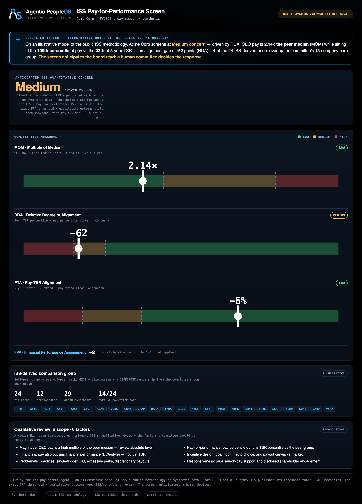

# Example: ISS Pay-for-Performance Screen

The Executive Compensation arm's **board-anticipation** agent: a dark, committee-ready dashboard that
shows how the **ISS quantitative pay-for-performance screen** would likely read the subject — so a
Compensation Committee can anticipate the proxy-advisor result and prepare its response.

It reads the shared ISS screen engine over a synthetic exec-pay/TSR dataset (subject = the same **Acme
Corp** the rest of the arm uses) and renders the overall concern level, the three measures, the
ISS-derived comparison group, and the qualitative factors a Medium/High concern puts in scope.

> **What this is — and isn't.** This is an **illustration of ISS's *published* methodology on *synthetic*
> data.** ISS **publishes** its quantitative concern threshold table and the weighted-least-squares /
> aggregation mechanics in its *Pay-for-Performance Mechanics* document (effective Feb 1, 2026); the
> thresholds and WLS weights here are taken directly from it (CAP's 2026 summary corroborates them). What
> ISS does **not** publish is the exact FPA threshold and the qualitative-evaluation outcome, which still
> require ISS/consultant review. This is **NOT ISS's actual output** — a real committee engages ISS or a
> consultant for its true standing. No real issuer, ticker, or proxy is represented.

## The screen (two steps)

1. **Comparison group** — a self-peer graph (the subject's self-selected peers ∪ companies that name it) +
   a peer-of-peer walk, then GICS + size screening to a ~14–24-name group. (A *different* membership from
   the committee's own peer group — the dashboard shows the overlap.)
2. **Quantitative measures** → Low / Medium / High concern:
   - **MOM** — CEO pay as a multiple of the peer median (50/50 blend of 1-yr & 3-yr).
   - **RDA** — 5-yr TSR percentile − pay percentile (negative = pay ahead of performance = concern).
   - **PTA** — absolute 5-yr trend of indexed TSR vs pay (negative = concern).
   - **FPA** — a financial-performance (EVA-style) nudge for a borderline case.

   A Medium/High screen triggers ISS's **qualitative review** — the factors a committee should be ready for.

## Run it
```bash
cd examples/iss-pay-screen
python run.py                                              # draft only
python run.py --publish --approved-by "Compensation Committee Chair"
```

## Test it
```bash
python evals/test_iss_pay_screen.py
```

## Sample output



- [Committee dashboard (HTML)](output/report.sample.html)
- [Committee digest](output/day1-digest.sample.md)

## What it demonstrates

- **Board-anticipation, not box-checking:** it models the proxy-advisor screen a committee must navigate —
  the highest-stakes part of exec comp — on transparent, public methodology.
- **Honest about model limits:** ISS *publishes* its concern thresholds and the WLS/aggregation mechanics
  (cited here from its *Pay-for-Performance Mechanics* doc); this example still uses an **illustrative**
  comparison-group, FPA, and qualitative-outcome model — the credible position, not fake precision.
- **Presentation + governance only:** every value comes from the shared engine; the agent does no math,
  fails closed, anticipates but never decides, and never recommends pay.
- **Two peer objects:** the ISS-derived comparison group is a different membership from the committee's own
  peer group — and the dashboard shows the overlap.
