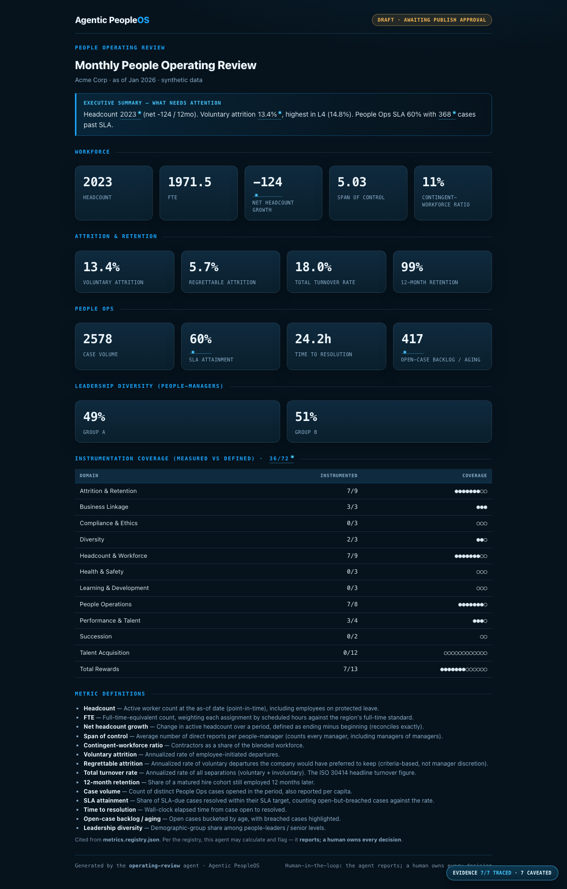

# Example: Monthly People Operating Review (cross-domain composer)

The Analytics-arm showpiece — one **People Operating Review** that assembles headline KPIs from every
domain (workforce, attrition, People Ops, diversity) via the shared compute engine, adds a
consolidated "what needs attention," and shows an honest **instrumentation-coverage map** (measured vs
defined metrics per domain). It ships only behind the **full role-scoped, ledger-backed approval gate**.

What makes this the proof point:

- **Composed, not recomputed.** Every number comes from the shared
  [`MetricEngine`](../../foundation/compute/engine.py); the composer does no math and re-implements no
  agent.
- **Honest coverage map.** It reports how many registry metrics are actually computed vs defined, per
  domain — "measured vs planned" at a glance.
- **The real approval gate.** Unlike the leaf reporting agents (which use a named-approver demo), this
  agent requires an **entitled human** to approve, adjudicated by the
  [`ApprovalRegistry`](../../core/approval_registry.py) and recorded in a **hash-chained decision
  ledger** ([`core/event_log.py`](../../core/event_log.py)) — re-verified for entitlement, channel
  ACL, and point-in-time registry version. A non-entitled actor is **denied, escalated, and refused**.

> All data is synthetic. No real company, system, or person is represented.

## Sample output



The committed [`output/decision.sample.events.jsonl`](output/decision.sample.events.jsonl) is the
ledger-verified approval for the published run (recommendation → approval → action).

## Run it
```bash
cd examples/operating-review
python3 run.py                                               # draft only
python3 run.py --publish --approved-by hr.business-partner   # entitled → published (ledger recorded)
python3 run.py --publish --approved-by obs.engineering       # not entitled → denied + escalation (refused)
```

Verify the decision ledger:
```bash
python3 -m core.event_log validate examples/operating-review/output/decision.sample.events.jsonl \
  --registry examples/visible-handoff/approval_registry.json
```

## Test it
```bash
python3 evals/test_operating_review.py
```
The eval proves the composer is presentation-only, the coverage map matches the engine, and the full
ledger gate: entitled → approved + verified + published; non-entitled → denied + escalated + refused;
the ledger validates in both outcomes. See [`SPEC.md`](SPEC.md).
