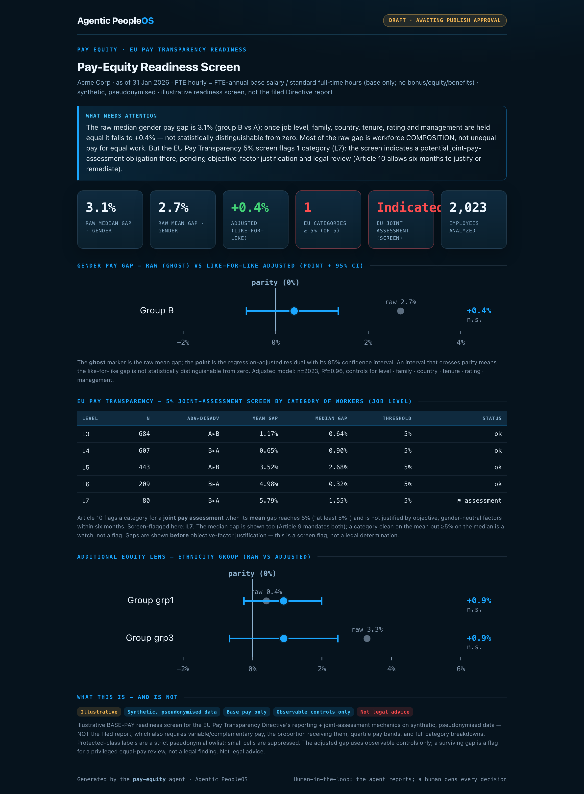

# pay-equity — pay-equity & EU Pay Transparency assessment

The Executive-Compensation arm's **pay-equity readiness screen**: an **illustrative base-pay** view a
Total-Rewards leader uses to get ahead of the **EU Pay Transparency Directive (2023/970)**. It is a readiness
screen, **not the filed report** — the Directive's Article 9 report also requires variable/complementary pay,
the proportion of each group receiving them, quartile pay bands, and full category breakdowns, none of which
this base-pay screen computes. From a single workforce table it renders the **raw base-pay gap** (mean and
median) and the **adjusted, like-for-like gap** that survives once job level, family, country, tenure, rating
and management are held equal — the latter as a forest plot of point estimate **+ 95% CI**, with the raw gap
drawn as a ghost. It then runs the Directive's **5% joint-pay-assessment screen** per category of workers.

```bash
python3 run.py                                          # draft dashboard + digest (nothing sent)
python3 run.py --publish --approved-by "Chief People Officer"
python3 evals/test_pay_equity.py                        # agent evals
python3 ../../foundation/compute/tests/test_pay_equity.py  # engine tests
```



**Why it matters.** The raw gap and the like-for-like gap are different questions, and conflating them is how
pay-equity conversations go wrong. The raw gap is mostly workforce **composition** — who sits in which level,
role, and country. The adjusted gap is the closest observable proxy for **unequal pay for equal work**, and
it is what an equal-pay audit investigates. Reporting both — the adjusted one always with its uncertainty —
lets a leader say honestly "our raw gap is X, our like-for-like residual is Y (with this confidence), and
here is where the EU 5% trigger fires." On the synthetic Acme data that is a 3.1% raw median gender gap that
falls to a non-significant +0.4% adjusted, while the EU screen still flags one senior level over 5%.

**Honesty.** Protected-class groups are **pseudonymised** (A/B, grp1-3) — the tool reports gaps between
groups and never asserts which real class a label denotes. "Category of workers" is job level, a stand-in
for the Directive's equal-work grouping (which in production comes from a gender-neutral job-evaluation
scheme). Pay is **base only**; the adjusted model uses **observable controls only**, so a surviving gap is a
flag for a privileged, cohort-level equal-pay review — **not a legal finding**, and the tool is **not legal
advice**. Synthetic data; presentation + governance only — the agent never proposes a pay change.
Provenance: [`governance/pay-equity-methodology.md`](../../governance/pay-equity-methodology.md).

Part of the [Agentic PeopleOS](../../README.md) Executive Compensation arm.
