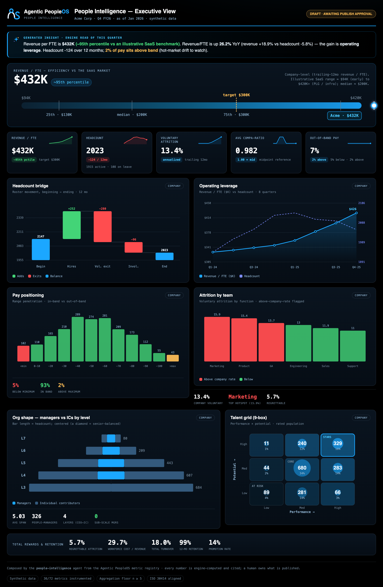

# Example: People Intelligence — Executive View (the marquee)

The Analytics-arm showpiece: one dark, one-page **executive dashboard** that composes headline People
metrics across domains — led by the **People↔Finance linkage** (Revenue/FTE, operating leverage) —
from the shared compute engine, and ships only behind a human publish gate.

What makes it the proof point:

- **Composed, not recomputed.** Every number — and every sparkline/trend point — comes from the
  shared [`MetricEngine`](../../foundation/compute/engine.py). Each of the 8 quarterly trend points is
  the *same engine re-evaluated at that quarter-end* (`series_multi`), reusing the engine's
  point-in-time discipline — real history, never faked.
- **The CFO's language.** The signature instrument is **Revenue/FTE** placed on an *illustrative*
  SaaS benchmark axis, with **operating leverage** (revenue growth vs headcount growth) beside it —
  the People↔Finance bridge most HR dashboards omit.
- **Talent risk + org health.** **Attrition by team** flags the retention hotspots (functions above
  the company rate), the **org-shape diamond** shows managers-vs-ICs by level (a senior-balanced org
  bulges in the middle), and a **Total Rewards & retention** strip carries regrettable attrition,
  workforce-cost-to-revenue, turnover, retention, and promotion rate.
- **Drawn deterministically.** Every chart is server-rendered inline SVG from
  [`foundation/render/charts.py`](../../foundation/render/charts.py) — no JavaScript, no CDN — so the
  committed **HTML/digest are byte-diffed in CI**. The PNG below is an *illustrative snapshot* of that
  HTML (PNG rendering is browser-dependent, so it isn't part of the deterministic gate).
- **Honest + governed.** It does no metric math, cites the registry, reports instrumentation coverage
  (measured vs defined), fails closed, is read-only, and stops at a named-approver publish gate.

> All data is synthetic. No real company, system, or person is represented.

## Sample output



## Run it
```bash
cd examples/people-intelligence
python3 run.py                                          # draft only
python3 run.py --publish                                # refused: needs a valid approver
python3 run.py --publish --approved-by "People Analytics Lead"
```

## Test it
```bash
python3 evals/test_people_intelligence.py
```
The eval proves the composer is presentation-only over the engine, the charts are deterministic and
injection-safe, the publish gate refuses an invalid approver, and it fails closed when the engine is
unavailable. See [`SPEC.md`](SPEC.md).
