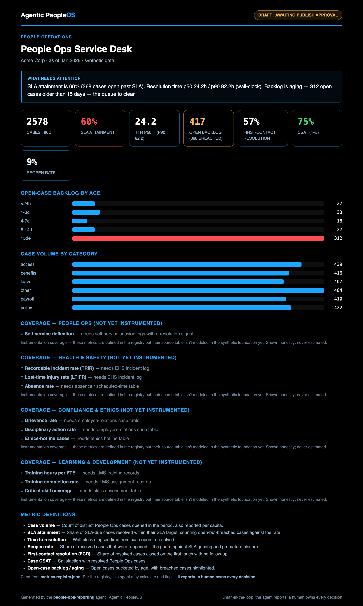

# Example: People Ops Service Desk reporting agent

An Analytics-arm agent on the shared compute engine — a **People Ops service-desk dashboard** for a
fictional company (Acme Corp): case volume, SLA attainment, time-to-resolution (p50/p90), reopen /
first-contact-resolution / CSAT, and an aging open-case backlog. It **stops at a human publish gate**.

Same design as the rest of the arm, with two points worth calling out:

- **Computed from raw facts, not trusted flags.** SLA attainment, resolution time, breach, and
  backlog are **recomputed by the engine from raw case open/resolve timestamps** — so a bad
  precomputed flag in the source can't become a trusted metric.
- **Honest instrumentation coverage.** 17 metrics route here; **7 (the service desk) are computed**,
  and the broader ISO 30414 areas (Health & Safety, Compliance & Ethics, Learning & Development) are
  shown **per-domain as not-yet-instrumented** with their named source needs — never estimated.

> All data is synthetic. No real company, system, or person is represented.

## Sample output



## Run it
```bash
cd examples/people-ops-reporting
python3 run.py
open output/report.sample.html
python3 run.py --publish --approved-by "People Ops Lead"
```

## Test it
```bash
python3 evals/test_people_ops.py
```
The eval proves the cards equal the engine's values, the SLA denominator includes open-and-breached
cases, the backlog age buckets reconcile to the open count, the per-domain coverage is honest,
fail-closed behavior, and the publish gate. See [`SPEC.md`](SPEC.md).
