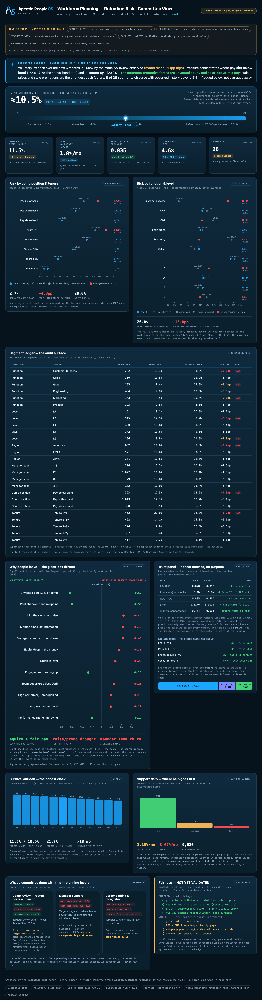

# Example: Retention Risk — Committee View (governed glass-box ML)

The retention-arm marquee: one dark, one-page **committee dashboard** that renders a **segment-first**
glass-box hazard model as a planning instrument — and ships only behind a human publish gate.

Its design thesis: every "AI for HR" dashboard *claims* to be trustworthy; this one **performs** it.

- **The published model, reconstructed — not re-fit.** Every number comes from the engine
  ([`foundation/compute/retention.py`](../../foundation/compute/retention.py)). The agent rebuilds the
  *pinned* trained artifact from its manifest (`model_from_manifest` — coefficients, standardizer,
  Platt calibration, band thresholds) and scores the exact published model, so the dashboard renders
  fast and reproduces the committed metrics in CI.
- **Disagreement as a first-class visual.** Segment risk is computed **two ways** — the model's
  calibrated bottom-up and the observed Kaplan-Meier top-down — and the gap is **plotted in red**, not
  averaged away. Customer Success reads 18.3% where history shows 3.3% (+15.0pp); a governed glass-box
  *shows* that and asks the committee to interrogate it.
- **Every metric beside its no-skill baseline.** On a ~1.8%-per-month event, honest numbers look
  small — so the trust panel prints the baseline next to each one (PR-AUC 0.078 *vs* 0.018;
  precision@decile 8.4% *vs* 1.8% → 4.6× lift, 76 of 900 flags real). The realism guard fails the
  build if the model looks *too* good, and prints the ceiling it refuses to cross right on the KPI.
- **Glass-box, exact, associational.** The driver panel is the model's additive log-odds per feature
  — unvested equity and comp-ratio protect; stale raises/promotions and manager-team churn push — the
  exact decomposition, labeled *associational, not causal*. Three planted decoy features rank
  #15/#17/#23 of 23: a legible leakage tripwire.
- **Segment-first, never a person.** No individual score, no name, no leaderboard anywhere; regions
  are broad-only; small segments are suppressed (floor n ≥ 30). Fairness is shipped as a visibly
  **unchecked checklist** — a governed system shows its unfinished edges. The
  [model card](../../governance/retention-risk-model-card.md) is the binding contract: this is a
  planning signal, **never** an adverse-action input.
- **Drawn deterministically.** Every chart is server-rendered inline SVG — no JavaScript, no CDN — so
  the committed **HTML/digest are byte-diffed in CI**. The PNG below is an *illustrative snapshot*
  (browser rendering isn't part of the deterministic gate).

> All data is synthetic. It demonstrates the **mechanics + governance** of a glass-box retention
> model, not real-world predictive accuracy. Voluntary exits only.

## Sample output



## Run it
```bash
cd examples/retention-risk
python3 run.py                                          # draft only
python3 run.py --publish                                # refused: needs a valid approver
python3 run.py --publish --approved-by "People Analytics Lead"
```

## Test it
```bash
python3 evals/test_retention_agent.py
```
The eval proves the composer is presentation-only over the engine (segment/company numbers equal the
engine's), the charts are deterministic and injection-safe, no per-employee identifier or country-level
region leaks, the honesty rails render (guardrails, no-skill baselines, decoy readout, unchecked
fairness boxes), the publish gate refuses an invalid approver, and it fails closed when the engine is
unavailable or the realism guard trips. See [`SPEC.md`](SPEC.md).
