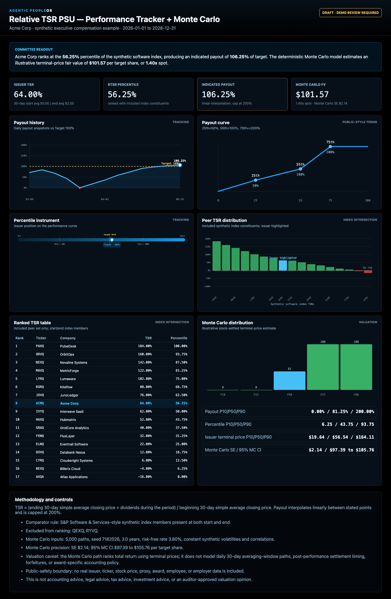

# Example: rTSR PSU Valuation

An Executive Compensation arm example that tracks a relative-TSR PSU award and estimates an
illustrative Monte Carlo fair value using deterministic, standard-library Python.

The public sample uses the same synthetic **Acme Corp** subject as the peer-group builder. The
issuer and peers use Q-marked fake tickers, and the engine rejects known real-ticker collisions
through the shared peer-universe deny-list.

What it demonstrates:

- **Public-style rTSR mechanics.** TSR is calculated from beginning and ending 30-day simple average
  prices plus dividends; the issuer is ranked against index members present at both the start and end
  of the performance period.
- **Committee-readable payout curve.** The sample curve is 25th percentile = 50%, 55th = 100%, and
  75th or above = 200%, with linear interpolation.
- **Operating tracker views.** The dashboard includes a synthetic payout-history line against the
  100% target and a peer TSR distribution with the issuer highlighted, matching the views a committee
  naturally asks for without using any real company or vendor data.
- **Monte Carlo without mystique.** The valuation helper simulates correlated terminal stock prices
  from caller-supplied assumptions and reports fair value per target share, Monte Carlo standard
  error, a 95% MC confidence interval, payout distribution, and the key assumptions used.
- **Governed output.** The agent fails closed on malformed data, writes deterministic local artifacts,
  and refuses demo publication without a named reviewer label.

All issuer, ticker, price, volatility, correlation, and peer data is synthetic. This is not
accounting advice, legal advice, tax advice, investment advice, or an auditor-approved valuation.

## Sample output



- [`output/report.sample.html`](output/report.sample.html)
- [`output/day1-digest.sample.md`](output/day1-digest.sample.md)

## Run it

```bash
cd examples/rtsr-psu-valuation
python run.py                                                # draft artifacts
python run.py --publish                                      # refused: missing reviewer label
python run.py --publish --approved-by "Compensation Committee Chair"  # demo publish marker
```

The `--approved-by` flag is a lightweight demo control, not the full role-scoped, ledger-backed
approval registry used by the operating-review example.

## Test it

```bash
python evals/test_rtsr_psu.py
```

The reusable math lives in [`foundation/compute/rtsr.py`](../../foundation/compute/rtsr.py); this
example is presentation and governance over that deterministic engine.
