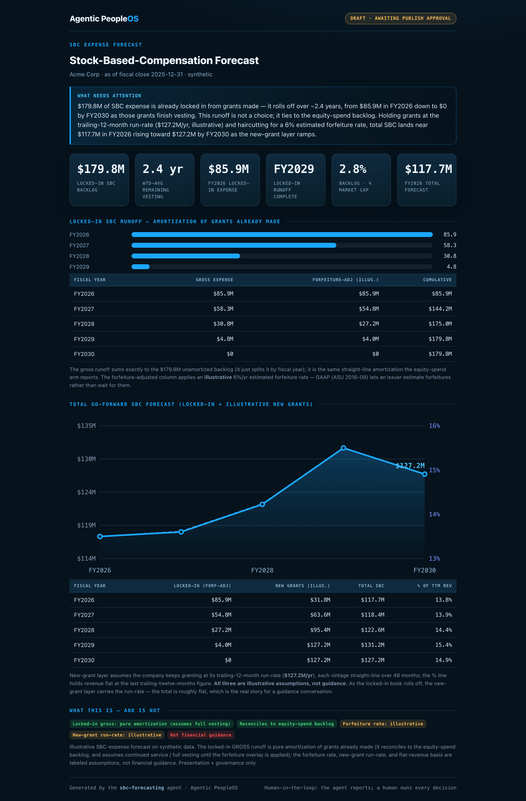

# sbc-forecasting — forward stock-based-compensation expense forecast

The Executive-Compensation arm's **forecasting deliverable**: the view a Total-Rewards leader takes into the
CFO/controller guidance conversation. Where the [equity-spend](../equity-spend/) arm answers "what did we
spend, is the plan defensible?", this arm answers **"how much SBC expense is already locked in, and what will
the run-rate be?"** Most of the near-term SBC line is not a choice — it is the amortization of grants already
made, rolling off a fixed schedule. From the append-only grant ledger it renders that **locked-in runoff** by
fiscal year (with an illustrative forfeiture-rate haircut) and a **total go-forward forecast** that layers an
illustrative steady-state new-grant run-rate on top.

```bash
python3 run.py                                          # draft dashboard + digest (nothing sent)
python3 run.py --publish --approved-by "Chief Financial Officer"
python3 evals/test_sbc_forecast_agent.py               # agent evals
python3 ../../foundation/compute/tests/test_sbc_forecast.py  # engine tests (incl. the equity-spend reconciliation)
```



**Why it matters.** SBC is a large, non-cash P&L line a company must guide on, and the honest first move is to
separate the **certain** from the **assumed**. The locked-in runoff is certain — it is the amortization of
grants already outstanding, and it ties **to the cent** to the equity-spend arm's unamortized-SBC backlog
(same amortization, split by fiscal year rather than stated as one number). On the synthetic Acme book that is
$179.8M rolling off from $85.9M in FY2026 to near zero by FY2029. Only then does the dashboard layer the
speculative part — a steady-state new-grant run-rate and an estimated forfeiture rate — to show the total run-
rate a guidance conversation actually needs.

**Honesty.** The locked-in **gross** runoff is pure amortization of grants already made — it carries one
stated service assumption (**continued service / full vesting** until the separate forfeiture overlay is
applied), nothing more. The forfeiture rate, the new-grant run-rate/attribution, and the flat-revenue basis
are **illustrative** assumptions — labeled as such, never guidance. GAAP (ASU 2016-09) permits estimating forfeitures; a forward forecast has no future actuals, so it
estimates. Synthetic company-wide data; presentation + governance only — the agent never issues guidance or
sizes a grant. Provenance:
[`governance/sbc-forecast-methodology.md`](../../governance/sbc-forecast-methodology.md).

Part of the [Agentic PeopleOS](../../README.md) Executive Compensation arm.
