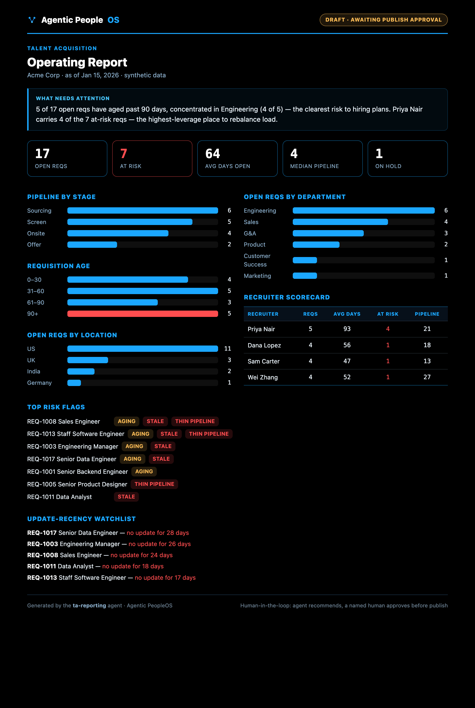

# Example: TA Reporting agent

A complete, runnable example of an Agentic PeopleOS agent — a **Talent Acquisition
reporting agent** for a fictional company (Acme Corp). It reads open requisitions, computes
the weekly operating report, drafts a Day-1 digest, and **stops at a human publish gate**.

It demonstrates, in one small agent, the principles the framework is built on:

- **a defined identity** ([`SOUL.md`](SOUL.md)) with immutable guardrails
- **a budget** ([`cost_tracker.json`](cost_tracker.json)) and tiered model use (the report
  needs no model at all)
- **scoped tools** ([`tools.yaml`](tools.yaml)) — read-only, with no "send" tool
- **human-in-the-loop** — it produces a *draft* and a human owns the publish decision
- **auditability** — the same input always produces the same report
- **an eval** ([`evals/test_report.py`](evals/test_report.py)) that guards the logic

> All data is synthetic. No real company, system, or person is represented.

## Sample output



A branded, self-contained HTML dashboard ([`output/report.sample.html`](output/report.sample.html))
plus a Day-1 digest. It opens with a data-derived insight ("what needs attention"), then KPIs,
pipeline / age / department breakdowns, a recruiter scorecard, risk flags, and a governance footer.

## Run it

No dependencies — Python 3.9+ standard library only.

```bash
cd examples/ta-reporting
python3 run.py
```

This writes the report and digest to `output/` and stops at the publish gate. Then:

```bash
open output/report.sample.html          # the operating report (macOS; use your browser)
cat  output/day1-digest.sample.md       # the digest a human reviews
```

To see the gate enforce itself:

```bash
python3 run.py --publish                          # refused — needs a named approver
python3 run.py --publish --approved-by "Dana Lopez"   # records the human approval
```

## Test it

```bash
python3 evals/test_report.py
```

The eval covers the happy path plus the fail-closed data contract (missing / empty / malformed
/ schema-invalid input) and the publish gate's exit codes.

See [`SPEC.md`](SPEC.md) for the full behavior, the data contract, fail-closed handling, the
risk-flag rules, and the publish gate.
