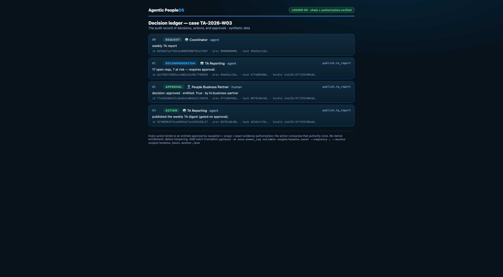

# Example: Visible handoff (the governance spine, end to end)

A coordinator agent asks the TA-reporting agent for the weekly report. The reporter posts a
**recommendation with cited evidence** to `#people-analytics` and stops. An **entitled** human
approves with a ✓. Only then does the gated action (publish) run. Every decision event carries the
same content-addressed evidence bundle, and every step is one row in a hash-chained ledger; the chat
is just the human-readable surface.

This is the answer to *"what bad thing did this prevent?"* — provable in code, transcript,
ledger, and evals. All data is synthetic (Acme Corp). No real Slack, no network, stdlib only.



*The decision ledger for this handoff (render it yourself: `python3 render_view.py`).*

## What it prevents (and proves with an eval)

| Threat | Defense | Eval |
|---|---|---|
| A non-HR human or a bot approving | entitlement is role-scoped + pool-based; re-derived, never self-reported | `evals/test_handoff.py` |
| A forged "approved" flag in the log | `validate_log(..., registry=reg)` re-derives entitlement | `core/tests/test_event_log.py` |
| Decision laundering (action with no approval) | action must bind to an entitled approval by causation **and** scope | both |
| Scope confusion (approval for X authorizes Y) | action scope must equal the approved scope | `test_event_log.py` |
| Artifact substitution after review | recommendation, approval, and action must carry the exact rendered/evidence bundle | both |
| One approval reused for two publishes | first valid action consumes the approval once | `test_event_log.py` |
| Replayed reaction double-approving | idempotency key → exactly-once | both |
| Retracted reaction "still counts" | only a present, entitled reaction authorizes | `test_handoff.py` |
| A channel message saying "approve everything" | messages are never approvals; injection logged + ignored | `test_handoff.py` |
| Tampering with the ledger after the fact | SHA-256 hash chain (+ optional HMAC for wholesale-rewrite) | `test_event_log.py` |

## Run it

```bash
# from the repo root
python3 examples/visible-handoff/run.py
cat examples/visible-handoff/output/transcript.md     # the conversation surface
cat examples/visible-handoff/output/events.jsonl      # the decision ledger (one row per event)
cat examples/visible-handoff/output/evidence-bundle.json  # exact rendered/evidence authorization target

# full integrity check — re-verifies the approval registry, not just the chain
python3 -m core.event_log validate examples/visible-handoff/output/events.jsonl \
  --registry examples/visible-handoff/approval_registry.json \
    --anchor examples/visible-handoff/output/events.jsonl.anchor.json --min-count 1

# resolve every decision authorization to that exact bundle
python3 -m core.evidence_bundle validate \
  examples/visible-handoff/output/evidence-bundle.json \
  --ledger examples/visible-handoff/output/events.jsonl \
  --verify-artifacts
```

The `--anchor` file is a committed checkpoint (`{count, head_hash}`) the ledger must **extend** —
a truncation back below it, or a rewritten head, fails closed. `--min-count N` additionally asserts the
ledger has grown to at least N rows, so a rollback to an empty-but-valid chain is caught too. (When the
agent opens a ledger it also auto-enforces a *co-located* `<log>.anchor.json`; the flag makes the same
guard explicit on the standalone check.)

Try the adversarial paths:

```bash
python3 examples/visible-handoff/evals/test_handoff.py   # spoofed/bot/duplicate/retracted/injected/tampered — all caught
```

## Both outcomes are committed (read without running anything)

`scenarios.py` regenerates two committed sample sets so a reviewer can see the denial path,
not just the happy path:

| Outcome | Approver | Result | Sample ledger / transcript |
|---|---|---|---|
| **approved** | People Business Partner (in the `hr_approver` pool) | gated publish runs | [`output/approved.events.sample.jsonl`](output/approved.events.sample.jsonl) · [transcript](output/approved.transcript.sample.md) |
| **denied** | Engineering Observer (channel member, **not** entitled) | no publish; agent escalates | [`output/denied.events.sample.jsonl`](output/denied.events.sample.jsonl) · [transcript](output/denied.transcript.sample.md) |

In the denied transcript the observer's ✓ *appears in chat* — you can't stop someone adding an
emoji — but the registry re-derives entitlement and refuses to count it, so the action never
runs. **The ledger validates in both cases**; it just records an escalation instead of an
action. Regenerate: `python3 examples/visible-handoff/scenarios.py`.

## Three sources of record

- **Chat (`transcript.md`)** is the source of record for the *conversation*.
- **The ledger (`events.jsonl`)** is the source of record for *decisions, actions, approvals*.
- **The evidence bundle (`evidence-bundle.json`)** is the content address of the exact artifacts and
  material claims that decision authorized.
- The HRIS/ATS (out of scope here) remains the source of record for employee/candidate *data*.

See [`SPEC.md`](SPEC.md) for the event schema, the binding rules, and the integrity model, and
[`governance/evidence-graph.md`](../../governance/evidence-graph.md) for the full evidence contract.
