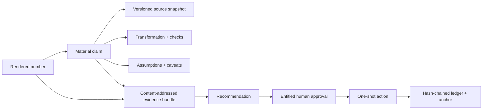

# Evidence Graph v1 — from a rendered number to the decision that used it

**Status:** implemented reference architecture · deterministic · offline · public-safe

Evidence Graph v1 makes a consequential number inspectable instead of merely plausible. A reviewer
can move from a number in a dashboard to the claim, source snapshot, transformation, assumptions,
checks, caveats, exact rendered artifact, human approval, and downstream action that consumed it.

This is a three-layer control, not a metadata tooltip:

1. A **claims-to-evidence manifest** explains each material claim.
2. An **evidence bundle** content-addresses the exact rendered bytes and manifests reviewed together.
3. The **decision ledger** binds recommendation → human approval → one-shot action to that same bundle.



## The questions every material claim can answer

| Question | Machine-readable answer |
|---|---|
| Where did it come from? | `claim.source_ids` or `supporting_claim_ids` → `sources[]`. |
| What version and as-of date? | `source.version`, `source.as_of`, `source.content_hash`, and `source.hash_scope`. |
| Which logic produced it? | `claim.transformation_id` → versioned `transformations[]`; `check_ids` identify the controls that passed. |
| What assumptions were applied? | `assumption_ids` → valued, versioned `assumptions[]`; caveats remain attached to the claim. |
| Who reviewed it? | An artifact review may live in `reviews[]`; a publish review is the human `approval` actor in the decision ledger. |
| What decision consumed it? | `decisions[]` can link a claim to an artifact decision; publish consumption is the ledger `action` bound to the approved bundle. |
| What changed from the prior cycle? | Every claim has an explicit `change` field. `null` means no governed comparison is available; a populated change carries the prior value, comparability, delta, and reconciled drivers. No delta is invented. |

The manifest contract is [`schemas/evidence-manifest.schema.json`](../schemas/evidence-manifest.schema.json),
implemented by [`core/evidence.py`](../core/evidence.py). Stable node ids make the graph diffable and
queryable without a graph database.

## What v1 covers

- **18 generated dashboards + 18 digests** have committed evidence sidecars.
- **216 material-claim occurrences** are declared and attached to the exact rendered locations where
  they appear.
- The HTML dashboards embed the same manifest shown in the evidence drawer; CI checks embedded/sidecar
  parity and refuses unreferenced material claims.
- Repository source snapshots are byte-hashed and can be re-hashed during verification.
- SBC forecasting and executive-comp benchmarking are the domain-rich reference implementations;
  the other 16 agents use a central, declarative consequential-claim catalog.

The coverage boundary is intentional. V1 traces the **three to ten claims that could change a decision**
in each portfolio artifact. It does not pretend every decorative tick, row, or supporting display value
has claim-level lineage. That narrower promise is tested and deletion-resistant; expanding dense
supporting-number coverage is a versioned follow-on, not an inflated v1 claim.

## The manifest graph

One sidecar travels with each artifact: `report.sample.evidence.json` for a dashboard and the equivalent
sidecar for its digest. Its closed schema rejects unknown fields and dangling references.

| Node | What it records |
|---|---|
| `artifact` | Stable id, producer, type, reporting period, lifecycle status, and semantic-model hash. |
| `claim` | Typed value/display value, unit, materiality, support status, reporting period, and links to every support node. |
| `source` | Stable id, URI, kind, version, as-of date, classification, content hash, and exact hash scope. |
| `transformation` | Named/versioned logic and its implementation entrypoint. |
| `assumption` | The actual value, unit, version, status, and supporting sources. |
| `check` | The contract/reconciliation asserted, implementation, assurance `attestation`, hashed `source_ids`, and pass/fail/not-run state. |
| `caveat` | A visible information, warning, or blocking limitation. |
| `review` | Reviewer role, timestamp, status, notes, and the exact claim ids reviewed. |
| `decision` | Decision type/owner/status, timestamp, artifact id, and claims consumed. |

Material claims may be `supported`, `caveated`, or `blocked`. A published/approved artifact cannot carry
a blocked material claim or omit approved review coverage. In the public examples the rendered artifacts
remain drafts, so their manifest review/decision collections are empty; the runnable publish examples
record the real approval and action in the ledger instead of rewriting the already-approved evidence.

Checks are deliberately explicit about assurance level: each records `attestation` (`producer` or
`independent`) and the hashed source ids it evaluated. A producer-attested `passed` record is evidence of
what the producer asserts it ran, not independent proof by itself; CI executes the public validators and
tests separately. A later review supersedes an earlier review for the same claims, so a newer rejection
cannot be masked by stale approval coverage.

## The exact-review problem

A normal approval record can say “an approver approved the January report” and still leave a fatal
ambiguity: *which bytes did that person see?* If the report or its evidence changes after review, the
words still look true.

[`core/evidence_bundle.py`](../core/evidence_bundle.py) closes that gap. For every artifact in one review
packet, the bundle records:

- resolvable `repo:` references (or an opaque production `urn:`) for the rendered artifact and manifest;
- SHA-256 of the exact rendered content;
- SHA-256 of the canonical evidence manifest;
- semantic report hash;
- sorted material-claim ids; and
- one shared producer/reporting-cycle identity.

The detached bundle hash avoids a circular hash: the artifact and evidence are hashed into the bundle;
the bundle is then copied into the authorization envelope. The public contracts are
[`evidence-bundle.schema.json`](../schemas/evidence-bundle.schema.json) and
[`evidence-authorization.schema.json`](../schemas/evidence-authorization.schema.json).

Ledger schema 1.2 requires that envelope on every recommendation with `requires_approval:true`, every
approval, and every action, regardless of scope spelling. Replay verifies exact equality at both boundaries. The first fully valid action consumes the
approval; a second action using it fails as a one-shot authorization replay. A malformed or substituted
attempt does **not** consume the genuine approval.

Therefore:

- change one rendered byte → different `content_hash` and bundle hash;
- change one evidence node → different `evidence_hash` and bundle hash;
- change the material-claim set → different claim-set hash and bundle hash;
- approve bundle A but attempt to publish bundle B → ledger violation;
- reuse approval A for a second publication → ledger violation.

## Runnable proof

The monthly operating review binds its exact dashboard + digest to its real publish decision:

```bash
python3 -m core.evidence_bundle validate \
  examples/operating-review/output/review.sample.evidence-bundle.json \
  --ledger examples/operating-review/output/decision.sample.events.jsonl \
  --verify-artifacts

python3 -m core.event_log validate \
  examples/operating-review/output/decision.sample.events.jsonl \
  --registry examples/visible-handoff/approval_registry.json \
  --anchor examples/operating-review/output/decision.sample.events.jsonl.anchor.json \
  --min-count 3
```

The first command re-hashes the referenced rendered artifacts, evidence sidecars, and repository source
snapshots, then proves that every authorization envelope resolves to that exact bundle. The second
independently proves the approval chain, entitlement, one-shot action, ledger integrity, and checkpoint
height. The visible-handoff example demonstrates the same contract in a readable chat flow.

Portfolio-wide verification is one command:

```bash
python3 tools/verify_evidence.py --portfolio --verify-sources --verify-rendered
```

It fails if a managed artifact/sidecar is deleted, a repository source hash drifts, a material claim loses
its rendered reference, the embedded graph differs from the sidecar, or a graph invariant breaks.

## Threat model

| Threat | Control | Remaining boundary |
|---|---|---|
| A polished but unsupported number | Material claim must link to a source/supporting claim, transformation, and check. | Human-defined materiality still needs an accountable owner. |
| Source changed after the report ran | Version/as-of/hash are pinned; repository bytes can be re-hashed. | A hash proves identity, not that the upstream fact was true. |
| Sidecar does not describe the visible dashboard | Rendered references + embedded-manifest parity + coverage gate. | V1 covers consequential claims, not every visual atom. |
| Reviewer saw A; system publishes B | Exact content/evidence bundle copied through recommendation, approval, and action. | The review surface must display the bundle fingerprint and correct artifact bytes. |
| Approval reused for another action | Valid action consumes the approval once during replay. | A production executor should run replay/transaction checks before the side effect, not only after append. |
| Non-entitled actor approves | Registry re-derives channel membership, role, scope, and registry version. | Enterprise identity proof and lifecycle sync are deployment concerns. |
| Ledger row is edited or removed | Hash chain, optional HMAC, head-count anchor, and monotonic `min_count`. | Non-repudiation requires separately controlled keys and WORM/append-only storage. |
| Evidence contains private HR data | Classification is explicit; this repo contains only synthetic/public-safe records. | Production manifests and raw sources require access controls, retention, and data minimization. |

## Production adapter pattern

V1 deliberately separates the evidence contract from any vendor. A Workday report, ADP payroll extract,
Fidelity equity/recordkeeping file, Radford survey cut, or finance-owned model becomes a governed source
adapter that emits the same minimum record:

```text
source_id · uri/URN · source version · as-of · classification · content hash · hash scope
```

The raw confidential file stays in the authorized source system or controlled object store; the graph can
carry a resolvable URN and hash without copying employee data into a public artifact. Transformations point
to versioned code or a versioned model definition. Claude or another model may draft a narrative, but its
output is a claim—not a source—and must inherit the sources, assumptions, checks, and review gate behind it.

For a real deployment, add connector attestations, access-controlled artifact storage, immutable approval
checkpoints, identity-provider-backed actor ids, and a transactional executor that validates the current
bundle immediately before the external write.

### Evidence-depth roadmap

The bulk portfolio adapter currently records one producer-attested report-contract check per artifact.
That is an honest statement of what the producer asserts it validated, not an independent execution
receipt and not a claim that every metric has a bespoke control. A v1.1 depth layer should add
content-addressed check-execution receipts and finer claim- or control-family checks, with independent
attestation only when a genuinely separate reviewer or system produced it. Producer checks must never be
relabelled as independent merely to make the graph look stronger.

## Honest limits

- Evidence Graph v1 proves **traceability and artifact identity**, not factual correctness or good judgment.
- The public repo does not connect to Workday, Fidelity, ADP, Radford, or any employer system.
- Public sample approvals are deterministic demonstrations, not electronic signatures.
- Source citations to external public records still require expert validation for real compensation work.
- The decision ledger is the source of record for approvals/actions; the HRIS, equity system, payroll
  system, and finance model remain authoritative for their underlying data.

Those limits are part of the design. A trustworthy system distinguishes what it can prove from what a
human or an authoritative system must still establish.
