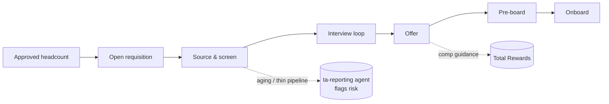

# Recruit-to-hire

The `ta-reporting` agent watches open requisitions for aging, staleness, and thin pipelines
(see [metrics glossary](../90-people-analytics/metrics-glossary.md)) and surfaces risk to
`#people-analytics` for a human to act on. The human owns who advances and the bar.
